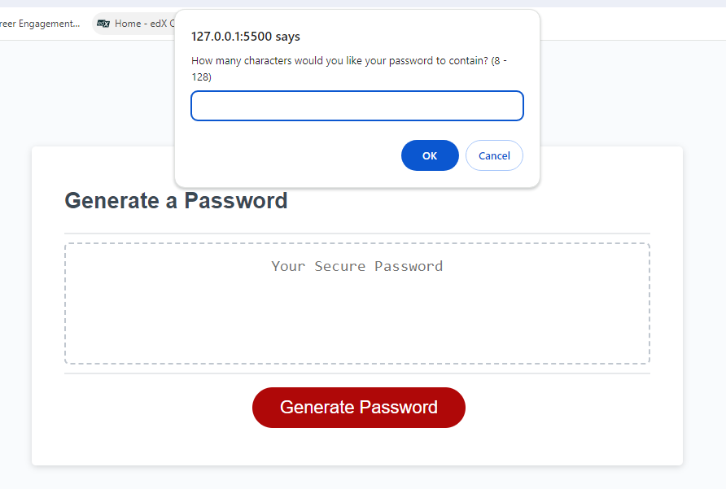
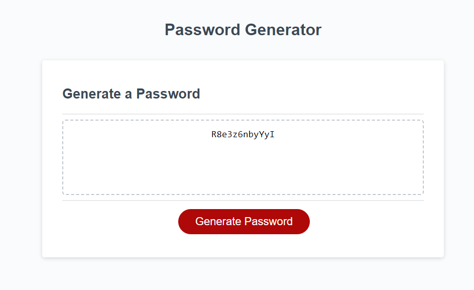
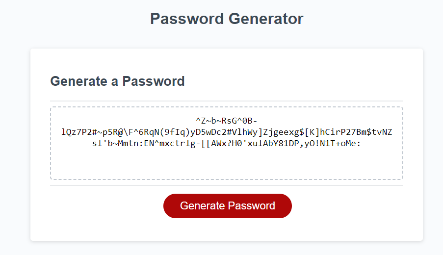

# Password Generator


<details>
  <summary>Table of Contents</summary>
  <ol>
    <li><a href="#Description">Description</a></li>
    <li><a href="#Screenshot">Screenshot</a></li>
    <li><a href="#Installation">Installation</a></li>
    <li><a href="#Usage">Usage</a></li>
    <li><a href="#Link">Link</a></li>
    <li><a href="#Credits">Credits</a></li>
    <li><a href="#License">License</a></li>
  </ol>
</details>


## Description
The main purpose of this generator is to allow a user to input specific criteria for their password and have it generated randomly for them. For example a user might want to only use numeric characters and uppercase characters in their password. The generator should take that input and generate a password that satisfies user criteria.


## Screenshot






## Installation


To install this project clone the repo
    ```
    git@github.com:Dominik-Jad/password-generator.git
    ```


Open the files in VS Code and select 'Open With Live Server' on index.html. Click on the 'generate password' button. Answer all the prompts and your password should be generated for you in the middle of the webpage.





## Usage


This simple password generator can be used by many different users who want a random password generated for them. The user is able to specify their criteria for a password and have it created for them based on their criteria. These passwords can range from simple all lowercase characters password to passwords with uppercase, lowercase, numeric and special characters.


## Link


https://dominik-jad.github.io/password-generator/


## Credits


parseInt() - https://developer.mozilla.org/en-US/docs/Web/JavaScript/Reference/Global_Objects/parseInt


Math.random() - https://developer.mozilla.org/en-US/docs/Web/JavaScript/Reference/Global_Objects/Math/random


Math.floor() - https://developer.mozilla.org/en-US/docs/Web/JavaScript/Reference/Global_Objects/Math/floor
## Licence


Please refer to the LICENCE in the repo.


